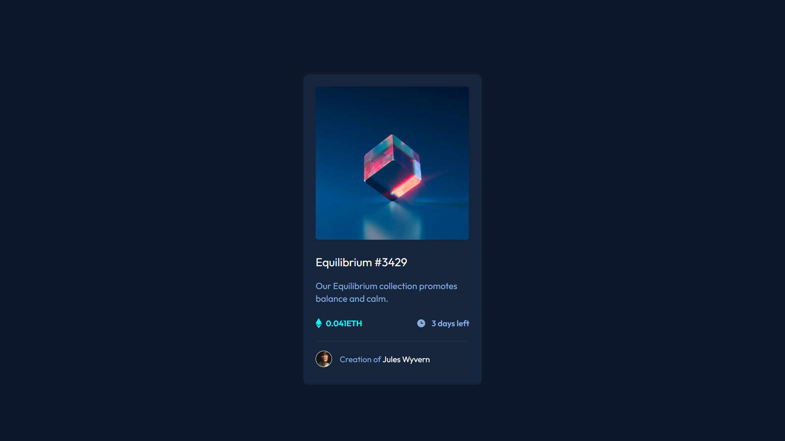

# Frontend Mentor - NFT preview card component solution

### The challenge

Users should be able to:

- View the optimal layout depending on their device's screen size
- See hover states for interactive elements

### Screenshot

### Links

- Solution URL: [solution](https://github.com/ramakrishnagarlapati/nft-preview-card-component)
- Live Site URL: [live](https://ramakrishnagarlapati.github.io/nft-preview-card-component/)

### Built with

- Semantic HTML5 markup
- CSS custom properties
- Flexbox
- Mobile-first workflow

